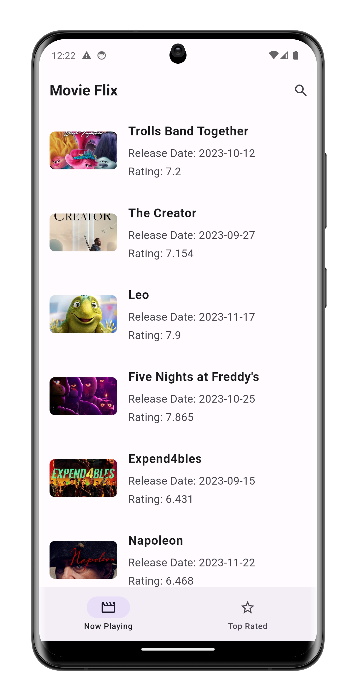
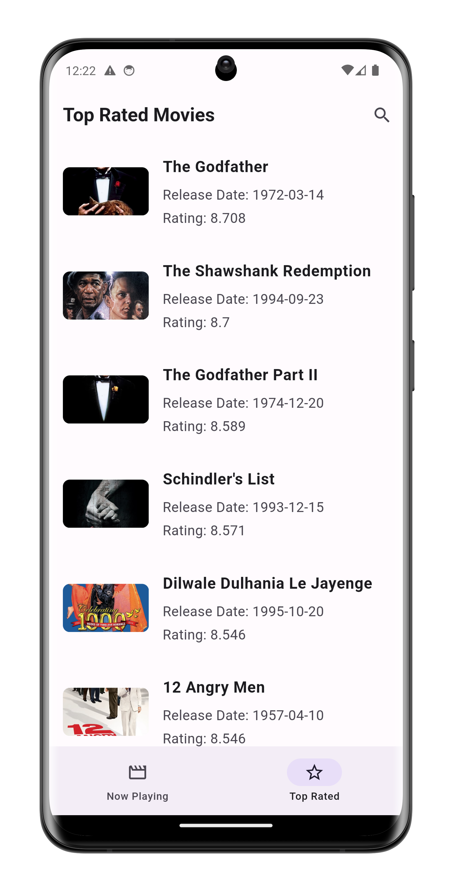
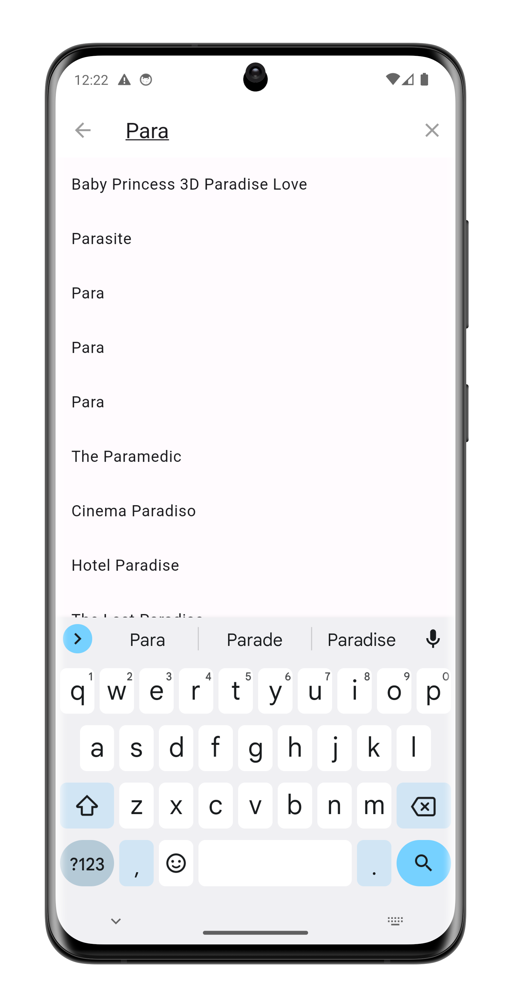
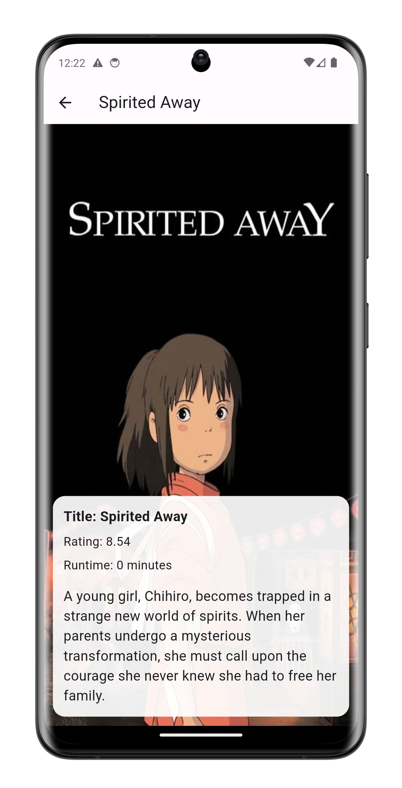

# movieflix

A movie showcasing app made using flutter and tmdb api is used for data .

## Features

- **Now Playing**:This Now Playing page shows the currently on airing movies.

- **Top rated**:The top rated movies are shown here

### Prerequisites

- [Flutter](https://flutter.dev/docs/get-started/install): Make sure you have Flutter installed on your system.

### Installation

1. Clone this repository:

   ```bash
   git clone https://github.com/Sm69mu/movieflix.git

   cd movieflix

   flutter pub get
   ```






A few resources to get you started if this is your first Flutter project:

- [Lab: Write your first Flutter app](https://docs.flutter.dev/get-started/codelab)
- [Cookbook: Useful Flutter samples](https://docs.flutter.dev/cookbook)

For help getting started with Flutter development, view the
[online documentation](https://docs.flutter.dev/), which offers tutorials,
samples, guidance on mobile development, and a full API reference.
